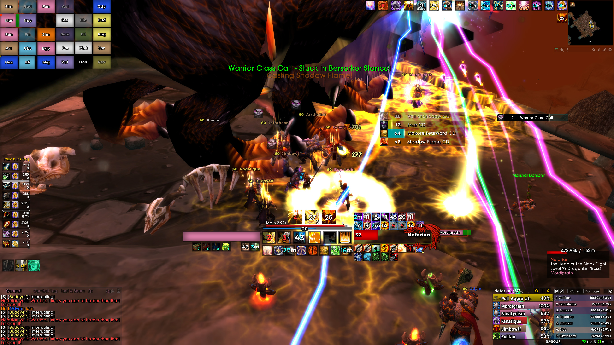

# tWoW-UI
Turtle WoW UI pack v 0.4

Files can now only be downloaded from boosty because github doesn't handle addons properly if they are updatable in the launcher (they have a .git folder inside)

Теперь файлы можно загружать только из boosty, поскольку github не обрабатывает дополнения должным образом, если они обновляются в лаунчере (у них есть папка .git внутри)

https://boosty.to/fantiq if u want to support
